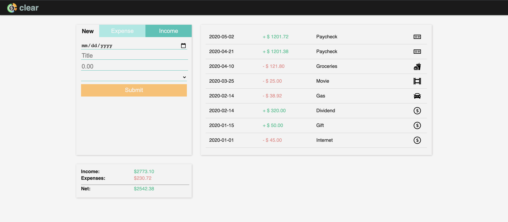

# vue-budget

Budget / expense-tracker app using Vue.js fundamentals.

Live demo [here](https://jgullickson.github.io/vue-budget/).

Users can create, view, update, and delete, and categorize transactions. Basic totals are displayed. Sample data is included for the demo.

## future directions

- Rebuild using single file component architechture.
- Add functionality for users to set budgets for different categories of expenses
- data visualizations of spending (e.g. pie charts)
- Add functionality to filter transaction list by category
- Hook up to back end with db, auth, etc

